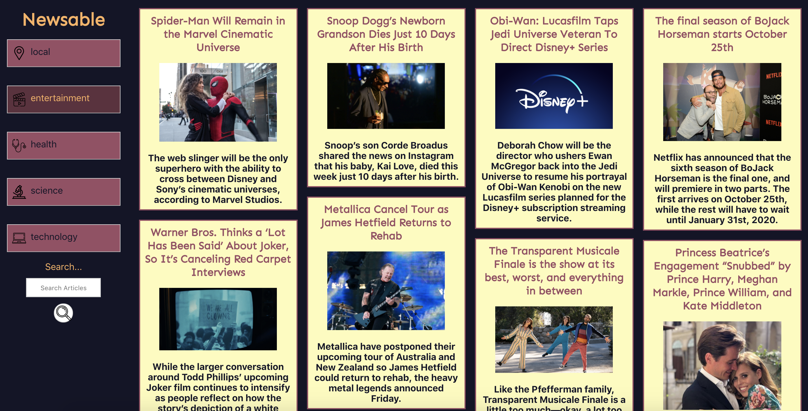

# Newsable

## Application Overview

This application loads news stories from an external API and allows users to filter stories based on topic and search them for specific keywords. It was built using React and was tested using snapshot in Jest. This is my first React-based JavascriptApplication, and it helped me learn functional and class-based React components as well as understand a new testing library. 

## Technologies Used

- JavaScript
- React
- fetch API
- CSS
- Jest
- Webpack

## Future iterations

- Once we learn how to test async functions with Jest, I would like to come back to do the integration testing
- Fetch from multiple APIs to have a more robust quantity of news sourses 

# Contributors

Lili Manrique
March 2020

This application was built with `create-react-app`.

